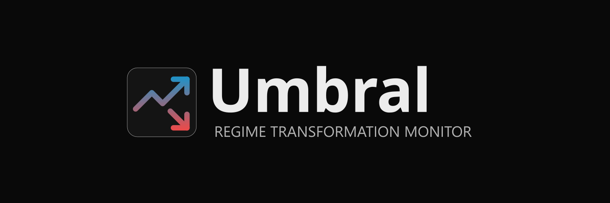

# Umbral

An open-source analytical platform monitoring regime transformation dynamics in Venezuela. Umbral tracks democratic erosion through real-time data, historical indices, curated news, and expert scenario analysis.

---

## Features

- **Scenario Analysis** — Five evidence-based regime transformation scenarios rated by experts and the public on a Likert 1–5 scale, with aggregated probability indicators
- **Historical Trajectory** — V-Dem style democracy index chart spanning 1900–2024
- **Live News Feed** — Aggregated news with category filtering, source filtering, full-text search, and per-scenario voting
- **Political Prisoners Tracker** — Aggregate detention statistics with demographic breakdowns by reporting organization
- **Interactive Timeline** — Democratic Episodes Event Dataset (DEED) with bilingual (Spanish/English) events
- **Reading Room** — Curated archive of books, articles, reports, and journalism
- **Fact-Checking Feed** — Bilingual curated fact-checking tweets
- **Participate** — Multi-step survey for experts and the public to submit scenario probability assessments
- **Bilingual** — Full Spanish/English internationalization throughout
- **Privacy-first Analytics** — GA4 integration gated behind explicit cookie consent

---

## Tech Stack

| Layer | Technology |
|---|---|
| Framework | Next.js 15 (App Router) |
| Language | TypeScript |
| Styling | Tailwind CSS, Framer Motion |
| Database | Supabase (PostgreSQL) with Row Level Security |
| Charts | Recharts |
| AI | Anthropic SDK |
| Scraping | Cheerio, RSS Parser |
| Icons | Lucide React |

---

## Getting Started

### Prerequisites

- Node.js 18+
- npm
- A [Supabase](https://supabase.com) project (optional — the app runs on local mock data without one)

### Installation

```bash
git clone https://github.com/pablohernandezb/umbral-project.git
cd umbral-project
npm install
```

### Environment Variables

Create a `.env.local` file in the project root. Without it, the app runs in **Mock Mode** using local sample data — no database required.

```env
# Supabase (required for live data)
NEXT_PUBLIC_SUPABASE_URL=https://your-project.supabase.co
NEXT_PUBLIC_SUPABASE_ANON_KEY=your-anon-key
SUPABASE_SERVICE_ROLE_KEY=your-service-role-key   # seed script only, never expose client-side

# Google Analytics (optional)
NEXT_PUBLIC_GA_ID=G-XXXXXXXXXX

# Anthropic (optional, for AI features)
ANTHROPIC_API_KEY=your-anthropic-key
```

> **Security note**: `SUPABASE_SERVICE_ROLE_KEY` is only used by the seed script and must never be exposed to the browser.

### Running the Development Server

```bash
npm run dev
```

Open [http://localhost:3000](http://localhost:3000).

---

## Mock Mode vs. Supabase Mode

The app detects which mode to use automatically:

| Mode | Condition | Data Source |
|---|---|---|
| **Mock Mode** | No valid `.env.local` | `data/mock.ts` (static local data) |
| **Supabase Mode** | Valid Supabase credentials in `.env.local` | PostgreSQL via Supabase |

Switch modes by adding or removing `.env.local`, then restart the dev server.

---

## Database Setup

If you want to connect a real Supabase database:

1. **Deploy the schema** — Copy the `SCHEMA_SQL` export from `lib/supabase.ts` into the Supabase SQL Editor and run it
2. **Configure credentials** — Add your Supabase URL and keys to `.env.local`
3. **Seed the database** — Run the seed script:

```bash
npm run seed
```

The schema creates 12 tables with RLS policies and real-time subscriptions enabled for `news_feed`, `political_prisoners`, and `scenarios`.

---

## Project Structure

```
umbral-project/
├── app/                    # Next.js App Router pages and API routes
│   ├── page.tsx            # Landing page (Command Center)
│   ├── about/
│   ├── how-did-we-get-here/
│   ├── news/
│   ├── participate/
│   ├── reading-room/
│   ├── privacy-terms/
│   ├── admin/              # Protected admin dashboard
│   └── api/                # API routes (fact-check, GDELT, news scraping)
├── components/
│   ├── layout/             # Header (with share menu), Footer
│   ├── ui/                 # ScenarioCard, NewsCard, MetricCard, Ticker, etc.
│   ├── charts/             # TrajectoryChart, GdeltSignalChart
│   ├── GoogleAnalytics.tsx
│   ├── CookieBanner.tsx
│   └── CookiePreferences.tsx
├── data/
│   ├── mock.ts             # Local mock data for all tables
│   └── seed.ts             # Database seed script
├── i18n/
│   ├── es/common.json      # Spanish translations (default)
│   └── en/common.json      # English translations
├── lib/
│   ├── supabase.ts         # DB client, IS_MOCK_MODE flag, SCHEMA_SQL
│   ├── data.ts             # Data access layer with mock fallback
│   └── cookie-consent.ts   # Cookie consent context
└── types/index.ts          # TypeScript interfaces mirroring DB schema
```

---

## Common Commands

```bash
npm run dev       # Start development server
npm run build     # Production build (type-checks + optimizes)
npm run start     # Start production server
npm run lint      # ESLint
npm run seed      # Seed Supabase database
```

---

## Internationalization

The app defaults to Spanish and supports English. Language is toggled via the header. All translation strings live in `i18n/es/common.json` and `i18n/en/common.json` and are accessed with the `useTranslation()` hook using dot notation:

```typescript
const { t } = useTranslation()
t('scenarios.democraticTransition.title')
```

---

## Contributing

Contributions are welcome. Please open an issue to discuss proposed changes before submitting a pull request.

1. Fork the repository
2. Create a feature branch (`git checkout -b feature/your-feature`)
3. Commit your changes
4. Push to the branch and open a Pull Request

---

## License

[MIT](LICENSE)
